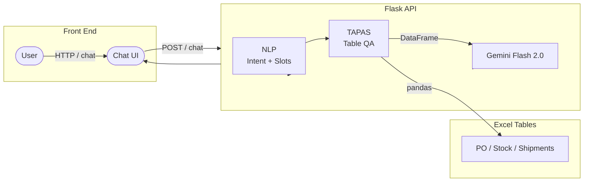
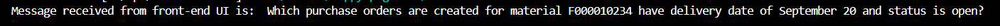
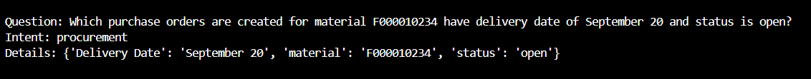
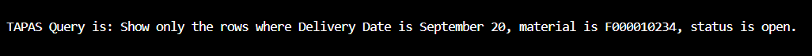
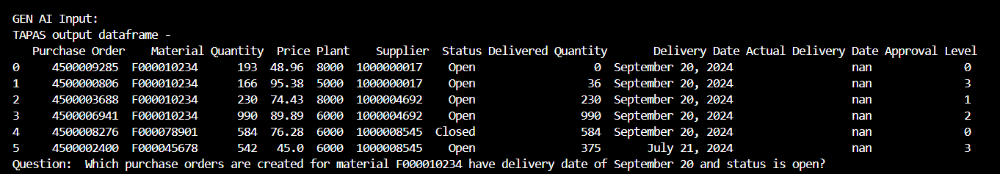
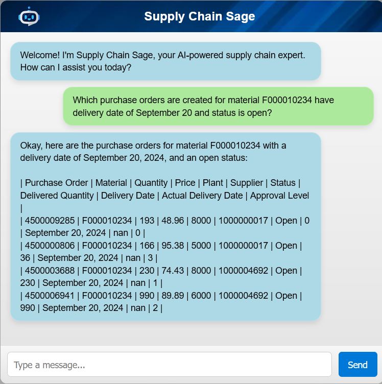

# 🏭 Generative AI and NLP based Supply‑Chain Chatbot (Sage)

A web‑based conversational assistant that connects to SAP‑style ERP data and answers procurement, inventory, and shipping questions in natural language.  
Built for an academic capstone at Drexel University (MS CS, 2025).

---

## ✨ Key Features
| Area | Example Questions the Bot Understands |
|------|---------------------------------------|
| **Procurement** | • “Which POs are pending approval?” • “Which purchase orders for material `F000010234` have a delivery date of **20 Sep** and are still open?” |
| **Inventory** | • “How much consignment stock is available at plant **7000**?” • “Which batches have quantity > 500?” |
| **Shipping** | • “Which shipments have destination **7000**?” • “What is the shipping ID of materials with expected delivery in **September**?” |

* Works on **tabular SAP‑like data stored in Excel**  
* **Intent + slot extraction** via custom NLP model  
* **TAPAS** (Table Parser) automatically converts slots to SQL‑like queries over Excel tables  
* **Gemini Flash 2.0** turns raw table rows into fluent answers (JSON → prose)  
* Exposed through a **Flask REST** back‑end and a lightweight HTML/JS chat UI  

---

### 🏗️ Architecture

## 🔄 Workflow

1. 💬 **User submits a question via the web-based chatbot.**  
   
   

2. 🔄 **Flask forwards the question to the backend using GET/POST requests.**  
   
   

3. 🧠 **The NLP component extracts the intent and details from the question.**  
   
   

4. 📊 **The Tapas component constructs a query and extracts relevant data from Excel files into a DataFrame.**  
   
   

5. 🤖 **The GenAI component processes the DataFrame and question to generate a response.**  
   
   

6. 📤 **The response is sent back to the frontend and displayed to the user.**  
   
   

### 🧰 Tech Stack

| Layer           | Technologies                                                                                                                           |
|-----------------|-----------------------------------------------------------------------------------------------------------------------------------------|
| 🖥️ **Frontend**  |    |
| ⚙️ **Backend**   |   |
| 🧠 **NLP**       |  + custom rule-based classifier                            |
| 📋 **Tabular QA**|  (via 🤗 Transformers)                             |
| 🤖 **Gen AI**    |  Flash 2.0 API                                            |
| 💾 **Data**      | Excel (openpyxl) + Pandas                                                                                                              |
| 🛠️ **DevOps**    | pip-tools, .env files, pre-commit hooks   
